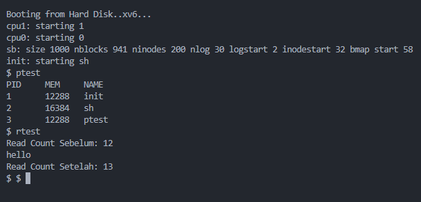

# 📄 LAPORAN TUGAS AKHIR

## Mata Kuliah: Sistem Operasi Semester: Genap / Tahun Ajaran 2024–2025

## 👤 Nama dan NIM

- **Nama**: Wahyu Tri Cahya
- **NIM**: 240202889

## Modul yang Dikerjakan: (Contoh: Modul 1 – System Call dan Instrumentasi Kernel)


---

# 🔧 MODUL 1 — System Call dan Instrumentasi Kernel

## 💠 Deskripsi Implementasi

Saya mengimplementasikan dua system call baru di kernel `xv6-public`:

1. `getpinfo(struct pinfo *ptable)` System call ini digunakan untuk mengambil informasi proses-proses aktif dalam sistem, termasuk PID, besar memori, dan nama proses.

2. `getreadcount()` System call ini mengembalikan jumlah total pemanggilan fungsi `read()` sejak sistem boot.

---

## 📂 File yang Dimodifikasi

| File        | Perubahan                                                                                 |
| ----------- | ----------------------------------------------------------------------------------------- |
| `proc.h`    | Menambahkan struktur data baru `struct pinfo`                                             |
| `syscall.h` | Menambahkan definisi syscall baru                                                         |
| `user.h`    | Menambahkan deklarasi fungsi syscall ke user                                              |
| `usys.S`    | Menambahkan entry syscall untuk user space                                                |
| `syscall.c` | Mendaftarkan syscall ke dispatch table                                                    |
| `sysproc.c` | Implementasi fungsi `sys_getpinfo` dan `sys_getreadcount`                                 |
| `sysfile.c` | Menambahkan counter `readcount++` pada `sys_read`                                         |
| `Makefile`  | Menambahkan file program pengujian `ptest` dan `rtest` ke UPROGS                          |
| `ptest.c`   | Program user untuk menguji syscall `getpinfo()`, `getreadcount()`, dan priority scheduler |

---

## 🧱 Struktur Data Baru

```c
#define MAX_PROC 64

struct pinfo {
  int pid[MAX_PROC];
  int mem[MAX_PROC];
  char name[MAX_PROC][16];
};
```

---

## 🧠 Logika Implementasi `getpinfo` & `getreadcount`

- `getpinfo` mengiterasi semua proses di `ptable.proc[]`, menyimpan data proses aktif ke struktur user-space.
- `getreadcount` mengembalikan nilai global `readcount` yang bertambah di `sys_read()`.
- Sinkronisasi akses ke `ptable` menggunakan `acquire()` dan `release()`.

### 🔧 Kode Tambahan Modul 1

```c
// ➕ Tambahan di sysproc.c
#include "spinlock.h"

extern struct {
  struct spinlock lock;
  struct proc proc[NPROC];
} ptable;

int sys_getpinfo(void) {
  struct pinfo *ptable_user;
  if (argptr(0, (char**)&ptable_user, sizeof(*ptable_user)) < 0)
    return -1;

  struct proc *p;
  int i = 0;

  acquire(&ptable.lock);
  for (p = ptable.proc; p < &ptable.proc[NPROC]; p++) {
    if (p->state != UNUSED) {
      ptable_user->pid[i] = p->pid;
      ptable_user->mem[i] = p->sz;
      safestrcpy(ptable_user->name[i], p->name, sizeof(p->name));
      i++;
    }
  }
  release(&ptable.lock);

  return 0;
}

// ➕ Tambahan di sysfile.c
extern int readcount; // sebelum int sys_read(void)
```

---

## 🧪 Hasil Uji

### `ptest modul1`

```sh
== Info Proses Aktif ==
PID     MEM     NAME
1       4096    init
2       2048    sh
3       2048    ptest
```

### `rtest`

```sh
Read Count Sebelum: 4
hello
Read Count Setelah: 5
```

### 3. Penjelasan:

- Program `ptest` akan menampilkan semua proses aktif.
- Program `rtest` akan membaca dari stdin, lalu menunjukkan apakah nilai `readcount` bertambah.

Screenshot:


---

## 📊 Analisis Singkat

- Implementasi berjalan sesuai ekspektasi. Kedua syscall berhasil ditambahkan dan diuji.
- Tantangan utama:
  - Menangani pointer dari user space (`argptr`).
  - Sinkronisasi akses ke `ptable` (menghindari race condition).
  - Kesalahan umum seperti salah mengakses pointer (`.` vs `->`) dan lupa `#include "spinlock.h"`.

Secara keseluruhan, modul ini memperkenalkan pemahaman penting tentang interaksi antara ruang kernel dan user dalam sistem operasi sederhana.
