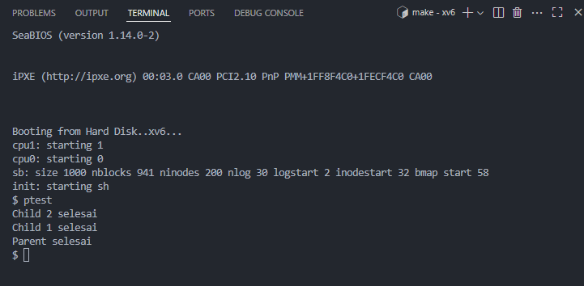

# 📝 Laporan Tugas Akhir

**Mata Kuliah**: Sistem Operasi  
**Semester**: Genap / Tahun Ajaran 2024–2025  
**Nama**: Wahyu Tri Cahya  
**NIM**: 240202889  
**Modul yang Dikerjakan**:  
Modul 2 – Penjadwalan CPU Non-Preemptive Berbasis Prioritas  

---

## 📌 Deskripsi Singkat Tugas

* **Modul 2 – Penjadwalan CPU Non-Preemptive Berbasis Prioritas**:  
  Mengganti scheduler default Round-Robin di xv6 menjadi scheduler berbasis prioritas **non-preemptive**. Proses dengan `priority` lebih rendah (nilai lebih kecil) akan didahulukan. Ditambahkan juga syscall `set_priority()` untuk mengatur prioritas proses dari user space.

---

## 🛠️ Rincian Implementasi

* Menambahkan field `int priority` pada struct `proc` di `proc.h`
* Menyesuaikan `allocproc()` dan `scheduler()` di `proc.c`
* Menambahkan syscall `set_priority(int)`:
  - Tambahan di `syscall.h`, `user.h`, `usys.S`, `syscall.c`, dan `sysproc.c`
* Program uji `ptest.c` dimodifikasi untuk menguji perilaku scheduler

---

## ✅ Uji Fungsionalitas

* `ptest modul2`: menguji penjadwalan berdasarkan prioritas
  - `Child 2` diberi prioritas tinggi (`10`)
  - `Child 1` diberi prioritas rendah (`90`)
  - Diharapkan output: `Child 2 selesai` muncul sebelum `Child 1 selesai`

---

## 📷 Hasil Uji

### 📍 `ptest`:

```
Child 2 selesai
Child 1 selesai
Parent selesai
```

### 📸 Screenshot:


---

## ⚠️ Kendala yang Dihadapi

| Masalah                                      | Solusi                                                                                          |
| -------------------------------------------- | ----------------------------------------------------------------------------------------------- |
| `proc` / `cpu` tidak dikenal di `scheduler()`| Tambahkan `extern struct cpu *cpu;` dan gunakan `mycpu()` untuk akses CPU                      |
| Tipe `lock` tidak lengkap                    | Tambahkan `#include "spinlock.h"` pada `proc.h`                                                 |
| `main` terduplikasi di `ptest.c`             | Gabungkan pengujian dalam satu `main()` dengan pemilihan via `argv[1]`                         |
| Proses prioritas rendah tetap jalan duluan   | Tambahkan `sleep(1)` agar proses prioritas tinggi sempat masuk ke scheduler lebih dahulu       |

---

## 📚 Referensi

* Buku xv6 MIT: [https://pdos.csail.mit.edu/6.828/2018/xv6/book-rev11.pdf](https://pdos.csail.mit.edu/6.828/2018/xv6/book-rev11.pdf)  
* Repositori xv6-public: [https://github.com/mit-pdos/xv6-public](https://github.com/mit-pdos/xv6-public)  
* Diskusi praktikum, GitHub Issues, Stack Overflow
  
---
