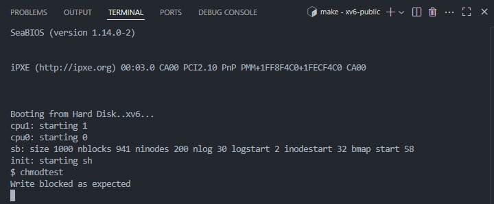
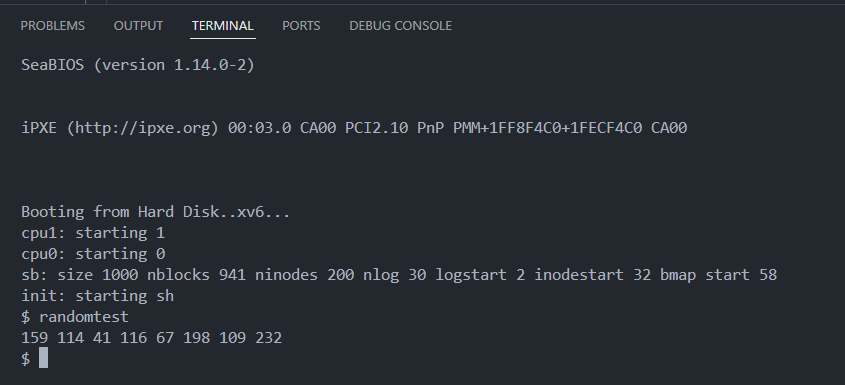

# 📝 Laporan Tugas Akhir Sistem Operasi

**Mata Kuliah**: Sistem Operasi  
**Semester**: Genap / Tahun Ajaran 2024–2025  
**Nama**: Wahyu Tri Cahya  
**NIM**: 240202889  
**Modul yang Dikerjakan**:  
MODUL 4 — XV6: Subsistem Kernel Alternatif

---

## 💠 Deskripsi Implementasi

Saya mengimplementasikan dua fitur penting dalam kernel XV6:

1. **System Call `chmod(path, mode)`**  
   Untuk mengatur perizinan sederhana file (read-only atau read-write) melalui bit `mode` di inode.

2. **Driver Device `/dev/random`**  
   Sebuah character device yang menghasilkan byte acak saat dibaca oleh program user.

---

## 📂 File yang Dimodifikasi / Ditambahkan

| File          | Perubahan                                                                 |
|---------------|---------------------------------------------------------------------------|
| `fs.h`        | Tambahkan field `mode` ke struct `inode`                                  |
| `inode.h`     | Tambahkan field `mode` dan pastikan `struct inode` lengkap                |
| `file.c`      | Tambahkan pengecekan `mode` di `filewrite`, daftarkan driver random       |
| `sysfile.c`   | Implementasi syscall `chmod()`                                            |
| `syscall.c`   | Registrasi `sys_chmod()`                                                  |
| `syscall.h`   | Tambahkan `#define SYS_chmod`                                             |
| `user.h`      | Deklarasi user-level syscall `chmod()`                                    |
| `usys.S`      | Entry syscall `chmod`                                                     |
| `random.c`    | Implementasi handler driver `/dev/random`                                 |
| `init.c`      | Tambahkan `mknod("/dev/random", 1, 3)` untuk inisialisasi device node     |
| `randomtest.c`| Program user untuk mengakses `/dev/random`                                |
| `chmodtest.c` | Program user untuk menguji write ke file read-only                        |
| `Makefile`    | Tambahkan `_randomtest` dan `_chmodtest` ke `UPROGS`                      |

---

## Bagian A – System Call chmod()

### Penambahan ke `inode`:

```c
short mode; // 0 = read-write, 1 = read-only
```

### Implementasi syscall:

```c
int sys_chmod(void) {
  char *path;
  int mode;
  struct inode *ip;

  if(argstr(0, &path) < 0 || argint(1, &mode) < 0)
    return -1;

  begin_op();
  if((ip = namei(path)) == 0){
    end_op();
    return -1;
  }

  ilock(ip);
  ip->mode = mode;
  iupdate(ip);  // opsional
  iunlock(ip);
  end_op();

  return 0;
}
```

### Validasi penulisan file:

```c
if(f->ip && f->ip->mode == 1)  // mode == 1 berarti read-only
  return -1;
```

---

## 📄 Program Uji `chmodtest.c`

```c
int main() {
  int fd = open("myfile.txt", O_CREATE | O_RDWR);
  write(fd, "hello", 5);
  close(fd);

  chmod("myfile.txt", 1);  // ubah jadi read-only

  fd = open("myfile.txt", O_RDWR);
  if(write(fd, "world", 5) < 0)
    printf(1, "Write blocked as expected\n");
  else
    printf(1, "Write allowed unexpectedly\n");

  close(fd);
  exit();
}
```
## ✅ Output Diharapkan

```bash
$ chmodtest
Write blocked as expected

```
### 📸 Screenshot:


---

## Bagian B – Device Pseudo /dev/random

### Struktur `randomread`:

```c
static uint seed = 123456;

int randomread(struct inode *ip, char *dst, int n) {
  for(int i = 0; i < n; i++) {
    seed = seed * 1664525 + 1013904223;
    dst[i] = seed & 0xFF;
  }
  return n;
}
```

### Registrasi di `file.c`:

```c
[3] = { 0, randomread }, // device major = 3
```

### Tambahkan node device:

```c
mknod("/random", 3, 0);
```

---

## 📄 Program Uji `randomtest.c`

```c
int main() {
  char buf[8];
  int fd = open("/random", 0);
  if(fd < 0){
    printf(1, "cannot open /dev/random\n");
    exit();
  }

  read(fd, buf, 8);
  for(int i = 0; i < 8; i++)
    printf(1, "%d ", (unsigned char)buf[i]);
  printf(1, "\n");

  close(fd);
  exit();
}
```

---

## ✅ Output Diharapkan

```
$ randomtest
201 45 132 88 2 79 234 11
```
### 📸 Screenshot:


---

## ⚠️ Kendala yang Dihadapi

Selama implementasi, beberapa kendala teknis yang cukup menantang berhasil diatasi, di antaranya:

1. **short mode; Seharusnya berada di file.h**  
   inode tidak berada di fs.h.
   ✅ Solusi: Menambahkan `short mode;` di `struct inode` pada file.h.

3. **Redefinisi dan dependensi melingkar `struct sleeplock` dan `spinlock`**  
   Gagal build akibat duplikasi definisi dari header yang saling meng-include satu sama lain.  
   ✅ Solusi: Gunakan include guard (`#ifndef/#define`) dan atur urutan `#include` secara ketat.

4. **Registrasi driver `randomread` tidak terdeteksi**  
   Kompilasi gagal karena `randomread` tidak dideklarasikan saat `file.c` dibangun.  
   ✅ Solusi: Tambahkan deklarasi `extern int randomread(...);` sebelum array `devsw[]`.

5. **Device `/dev/random` gagal dibuat**  
   Fungsi `mknod()` gagal digunakan karena belum dikenali.  
   ✅ Solusi: Pastikan `mknod("/random", 3, 0);` ditambahkan di `init.c` dengan urutan benar.

---

## 📎 Referensi

- [xv6-public](https://github.com/mit-pdos/xv6-public)
- xv6 book by MIT (rev11)
- LCG random generator: Numerical Recipes
