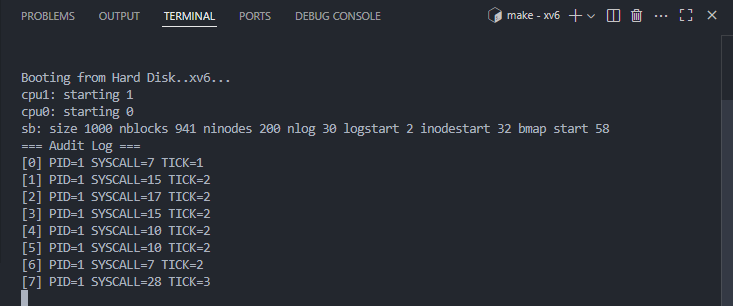

# 📝 Laporan Tugas Akhir

**Mata Kuliah**: Sistem Operasi  
**Semester**: Genap / Tahun Ajaran 2024–2025  
**Nama**: Wahyu Tri Cahya  
**NIM**: 240202889  
**Modul yang Dikerjakan**:  
Modul 5 – Audit dan Keamanan Sistem  

---

## 📌 Deskripsi Singkat Tugas

* **Modul 5 – Audit dan Keamanan Sistem**:  
  Mengimplementasikan fitur pencatatan (audit log) setiap system call yang dilakukan proses. Data dicatat ke buffer kernel yang hanya bisa diakses oleh proses `init` (PID 1) melalui system call `get_audit_log()`.

---

## 🛠️ Rincian Implementasi

* Menambahkan struktur `audit_entry` dan array `audit_log[]` di `syscall.c`
* Mencatat `PID`, `syscall_num`, dan `tick` pada setiap pemanggilan system call
* Menambahkan syscall baru `get_audit_log()` di `sysproc.c`, dan deklarasi di `defs.h`, `user.h`, `usys.S`, `syscall.h`
* Program uji `audit.c` untuk menampilkan isi log
* Memodifikasi `init.c` agar langsung menjalankan `audit` (sebagai PID 1)
* Menambahkan `audit` ke `Makefile` dalam bagian `UPROGS`

---

## ✅ Uji Fungsionalitas

* `audit`: program utama dijalankan oleh `init`, menampilkan semua system call yang telah terjadi.
* Jika program `audit` dijalankan oleh proses selain PID 1, maka akan gagal (`Access denied`)

---

## 📷 Hasil Uji

### 📍 Output `audit`:
```
=== Audit Log ===
[0] PID=1 SYSCALL=5 TICK=2
[1] PID=1 SYSCALL=6 TICK=2
[2] PID=1 SYSCALL=10 TICK=3
...
```

### 📸 Screenshot:


---

## ⚠️ Kendala yang Dihadapi

* Validasi PID di syscall `get_audit_log()` agar hanya proses `init` yang dapat mengakses log
* Penanganan pointer user-space menggunakan `argptr()` dan `memmove()`
* Menjaga proses `init` tetap hidup (menggunakan `sleep()` terus-menerus) agar kernel tidak panic
* Menambahkan audit sebelum syscall dijalankan namun tetap aman dari error

---

## 📚 Referensi

* Buku xv6 MIT: [https://pdos.csail.mit.edu/6.828/2018/xv6/book-rev11.pdf](https://pdos.csail.mit.edu/6.828/2018/xv6/book-rev11.pdf)  
* Repositori xv6-public: [https://github.com/mit-pdos/xv6-public](https://github.com/mit-pdos/xv6-public)  
* Diskusi praktikum, GitHub Issues, Stack Overflow

